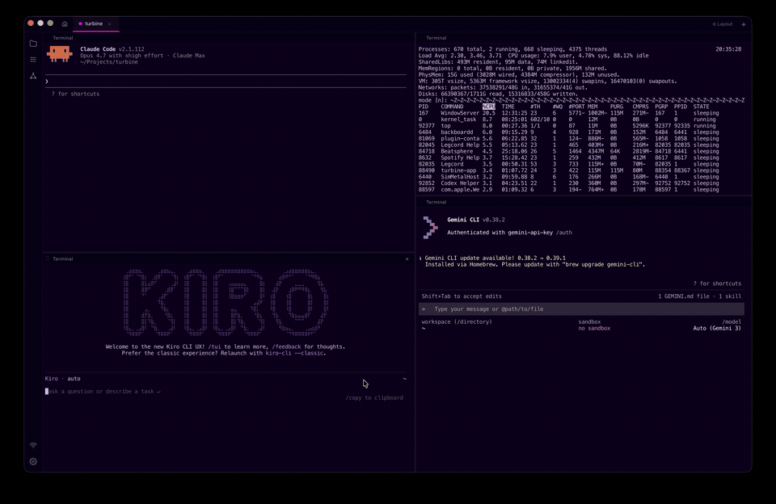
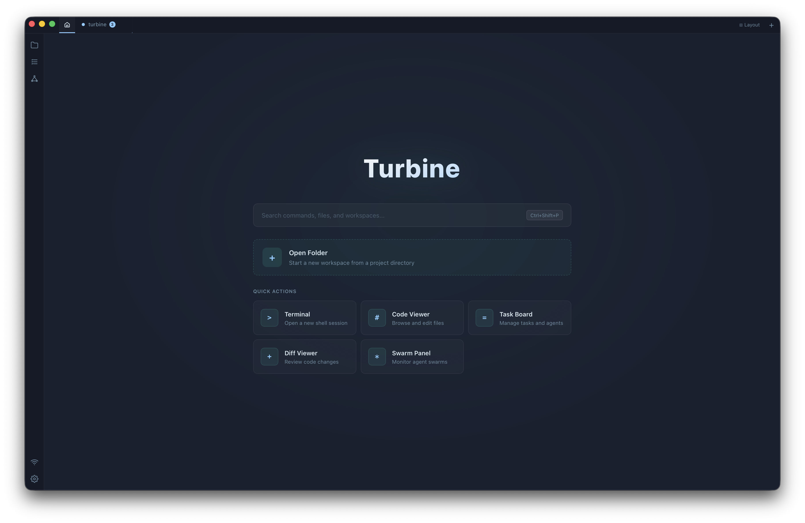
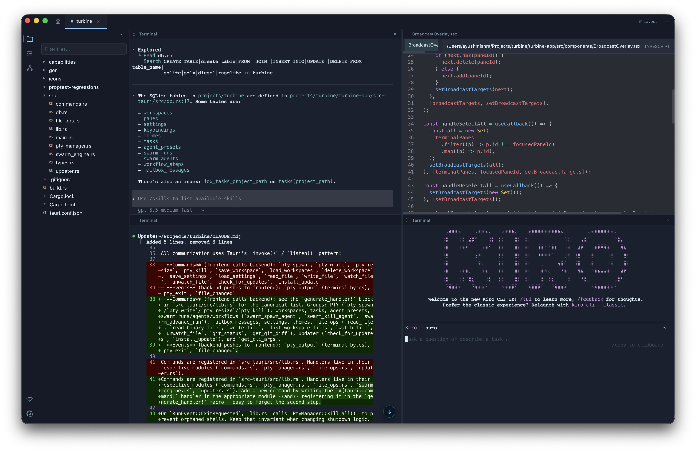
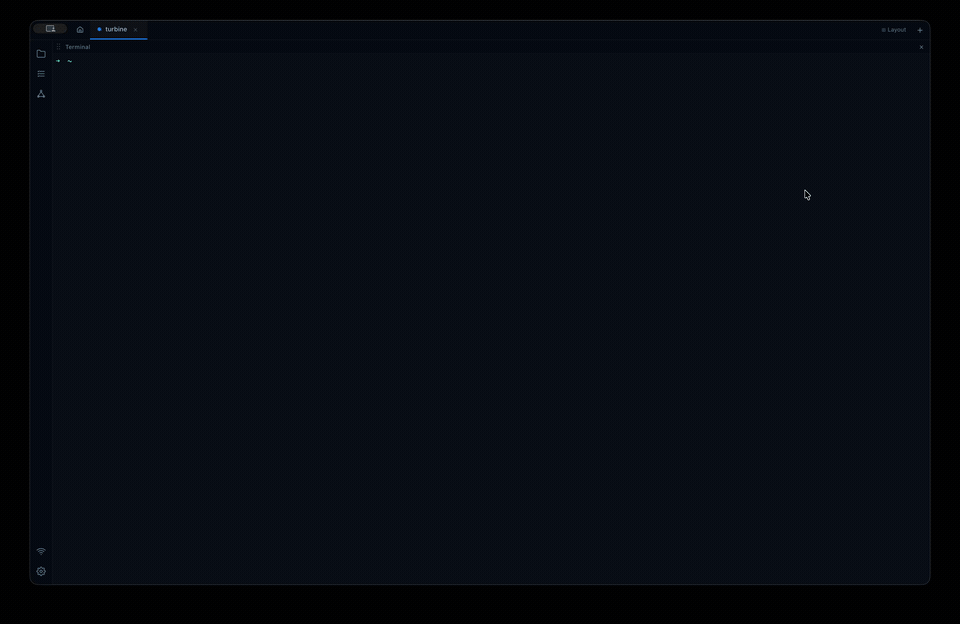
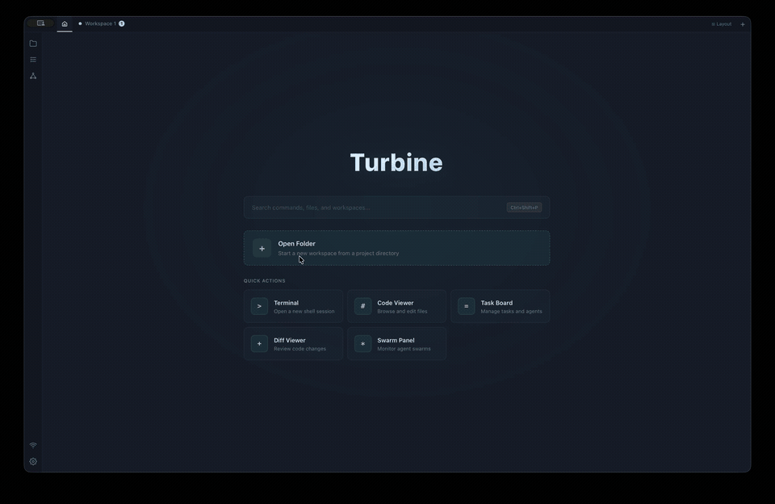
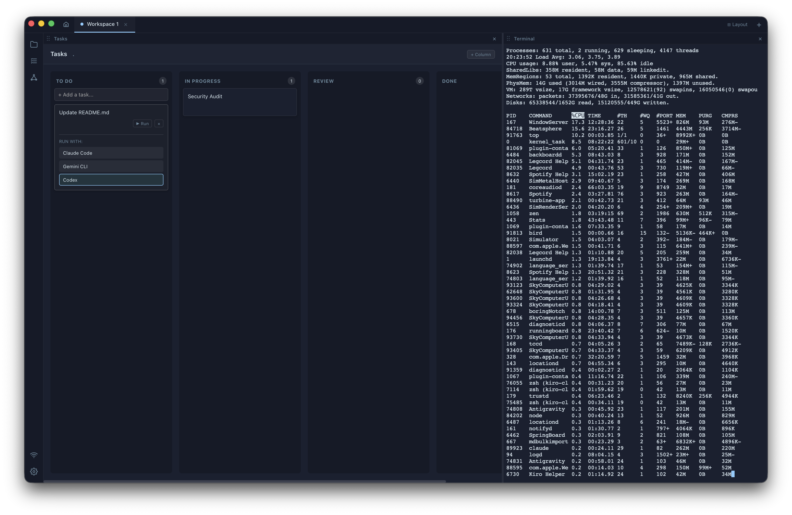
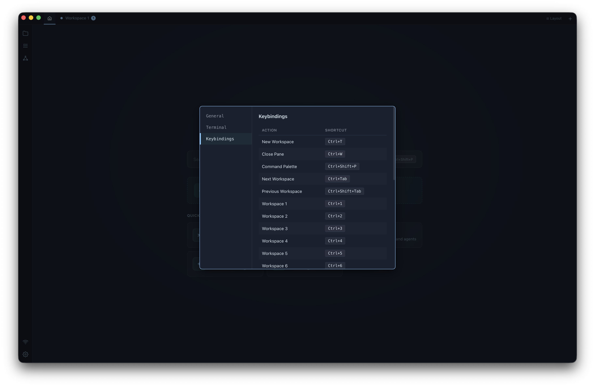

# Turbine

> **Developer Preview / Early Beta** — Turbine is under active development. Expect rough edges.

Turbine is an open-source mission control for AI coding agents. Run Claude Code, Gemini CLI, OpenAI Codex, Kiro, Aider, or any CLI tool side-by-side in a tiled terminal workspace with built-in code editing, task management, and multi-agent orchestration.

Built on [Tauri v2](https://tauri.app) with a Rust backend and React 19 frontend.



## Screenshots

### Home Screen


### Multi-Pane Workspace


### Quick Pane Layouts


### Theme Switcher


### Task Board


### Settings


## Features

- **Multi-agent terminal** — run any CLI agent in parallel panes with full xterm.js rendering (WebGL)
- **Binary tree pane layout** — split horizontally/vertically, resize, drag-and-drop to rearrange, templates for 1–16 panes
- **AI swarm orchestration** — configure agent presets, launch multi-agent workflows, track status from a dedicated swarm panel
- **Built-in code viewer** — CodeMirror 6 editor with syntax highlighting for 20+ languages, incremental loading, and save support
- **Task board** — Kanban board with customizable columns, scoped per project
- **Diff viewer** — review git diffs from agent-generated changes
- **File browser** — side panel with tree view, git status indicators, and fuzzy search
- **11 built-in themes** — Subnautica (default), Deep Ocean, Midnight Ember, Aurora Borealis, Neon Tokyo, Forest Canopy, Arctic Frost, Solar Flare, Void Purple, Copper Oxide, Monochrome
- **Command palette** — fuzzy search for all actions via Ctrl+Shift+P
- **Broadcast mode** — type once, send to all terminal panes simultaneously
- **Notification center** — toast alerts when background processes complete
- **Workspace persistence** — auto-save to SQLite, restore on startup
- **Keyboard-driven** — fully customizable keybindings, directional pane navigation, workspace switching
- **Custom pane titles** — double-click to rename any pane; titles persist across restarts
- **Cross-platform** — macOS, Windows, Linux

For a detailed feature-by-feature status against the original spec, see [`docs/FEATURE_STATUS.md`](docs/FEATURE_STATUS.md).

## Prerequisites

- [Rust](https://rustup.rs) (stable toolchain)
- [Node.js](https://nodejs.org) 20+
- [pnpm](https://pnpm.io) 9+
- Platform-specific dependencies per the [Tauri prerequisites guide](https://tauri.app/start/prerequisites/)

### Optional: AI Agent CLIs

Task runner and swarm features depend on external CLI tools being installed and available on your `PATH`:

| Agent | Install |
|-------|---------|
| [Claude Code](https://docs.anthropic.com/en/docs/claude-code) | `npm install -g @anthropic-ai/claude-code` |
| [Gemini CLI](https://github.com/google-gemini/gemini-cli) | `npm install -g @anthropic-ai/gemini-cli` (or see repo) |
| [OpenAI Codex](https://github.com/openai/codex) | `npm install -g @openai/codex` |

Any CLI tool that reads from stdin/stdout works — configure custom agent presets in the Swarm Panel.

## Quick Start

```bash
# Clone the repo
git clone https://github.com/ayushh2k/turbine.git
cd turbine/turbine-app

# Install frontend dependencies
pnpm install

# Run in development mode (compiles Rust + starts Vite dev server)
pnpm tauri dev

# Build for production
pnpm tauri build
```

The first run is slow due to Rust compilation. Subsequent runs use incremental builds.

**Always use `pnpm`, never `npm`.**

## Tech Stack

| Layer | Technology |
|-------|------------|
| Desktop framework | [Tauri v2](https://tauri.app) |
| Backend | Rust (PTY management via `portable-pty`, SQLite via `rusqlite`, file I/O via `notify`) |
| Frontend | [React 19](https://react.dev) + [Zustand](https://zustand.docs.pmnd.rs) |
| Terminal emulator | [xterm.js](https://xtermjs.org) with WebGL renderer |
| Code editor | [CodeMirror 6](https://codemirror.net) |
| Database | SQLite (embedded, no external server) |

## Architecture

```
┌─────────────────────────────────────────────────┐
│                  Tauri Window                    │
│  ┌───────────────────────────────────────────┐  │
│  │  React Frontend                           │  │
│  │  ┌─────────┐ ┌──────────┐ ┌───────────┐  │  │
│  │  │ TabBar  │ │ Pane     │ │ Command   │  │  │
│  │  │         │ │ Container│ │ Palette   │  │  │
│  │  └─────────┘ └──────────┘ └───────────┘  │  │
│  │  Zustand stores · Layout engine · Themes  │  │
│  └──────────────────┬────────────────────────┘  │
│                     │ IPC (invoke / listen)      │
│  ┌──────────────────┴────────────────────────┐  │
│  │  Rust Backend                             │  │
│  │  PTY Manager · SQLite · File Watcher      │  │
│  └───────────────────────────────────────────┘  │
└─────────────────────────────────────────────────┘
```

**Key entry points:**

- `src/App.tsx` — app composition, workspace lifecycle, layout actions
- `src/state/workspaceStore.ts` — persisted workspace and pane state
- `src/state/layoutEngine.ts` — pure binary-tree layout logic
- `src/components/TerminalPane.tsx` — xterm.js terminal integration
- `src-tauri/src/lib.rs` — Tauri setup and command registration
- `src-tauri/src/pty_manager.rs` — native PTY management
- `src-tauri/src/commands.rs` — backend command surface and persistence

For a guided architecture overview, see:

- [`docs/codebase-map.md`](docs/codebase-map.md)
- [`CONTRIBUTING.md`](CONTRIBUTING.md)
- [`.kiro/specs/turbine/design.md`](../.kiro/specs/turbine/design.md)

## Contributing

Contributions are welcome! Please see [`CONTRIBUTING.md`](CONTRIBUTING.md) for guidelines.

1. Fork the repo
2. Create a feature branch (`git checkout -b feature/my-feature`)
3. Make your changes
4. Run checks: `cargo check`, `npx tsc --noEmit`, `pnpm vitest --run`
5. Open a pull request

## License

[MIT](LICENSE)
